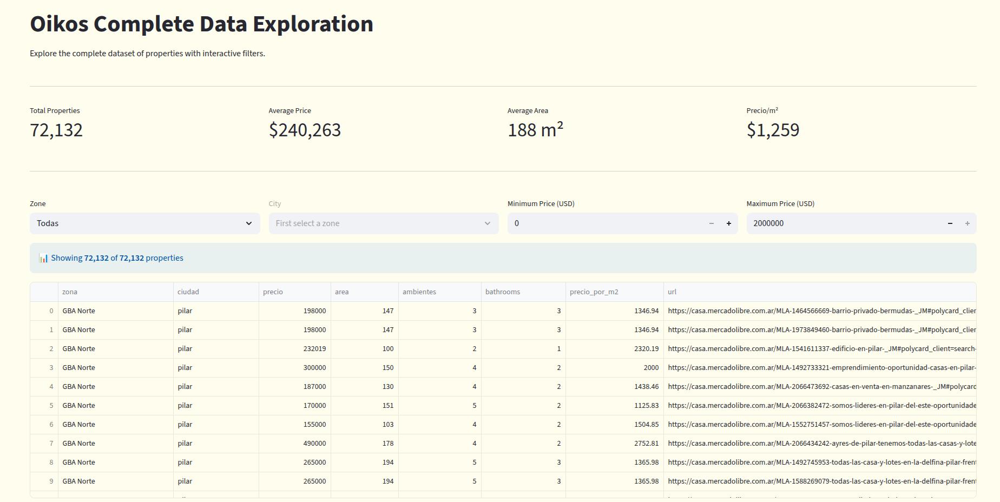

# Oikos Data Exploration



## Descripción

**Oikos Data Exploration** es una extensión del proyecto **Oikos**, una aplicación web de búsqueda de propiedades Inmobiliarias. Este proyecto se encarga de explorar, analizar y visualizar el dataset completo de propiedades utilizado en la aplicación principal.

## Características

- **Dashboard Interactivo**: Interfaz web construida con Streamlit para explorar los datos
- **Scrapers**: Scripts para obtener datos de propiedades desde fuentes públicas
- **Base de Datos**: Almacenamiento de propiedades en SQLite
- **Análisis de Datos**: Herramientas para limpiar y analizar el dataset

## Estructura del Proyecto

```
oikos_data_exploration/
├── analysis/          # Scripts de análisis de datos
│   ├── 01_analizar_dataset.py
│   └── 02_limpiar_datos.py
├── dashboard/        # Aplicación Streamlit
│   └── app.py
├── database/         # Base de datos SQLite
│   └── propiedades.db
├── images/           # Imágenes del proyecto
│   └── oikos-exploration.png
├── scraper/          # Scrapers para obtener datos
│   ├── scraper_ml.py
│   ├── scraper_ml_incremental.py
│   └── processing.py
├── src/              # Utilidades y datos
│   ├── db_utils.py
│   ├── crear_db.py
│   └── limpiar_db.py
└── requirements.txt
```

## Requisitos

- Python 3.8+
- streamlit
- pandas
- plotly
- requests
- beautifulsoup4
- lxml

## Instalación

```bash
pip install -r requirements.txt
```

## Uso

### Ejecutar el Dashboard

```bash
streamlit run dashboard/app.py
```

Esto abrirá una interfaz web donde podrás:

- Ver métricas generales del dataset
- Filtrar propiedades por zona, ciudad y rango de precios
- Explorar la tabla completa de propiedades

### Ejecutar los Scrapers

```bash
# Scraper completo
python scraper/scraper_ml.py

# Scraper incremental
python scraper/scraper_ml_incremental.py
```

### Análisis de Datos

```bash
# Analizar dataset
python analysis/01_analizar_dataset.py

# Limpiar datos
python analysis/02_limpiar_datos.py
```

## Relación con Oikos

Este proyecto es una **extensión** del proyecto principal **Oikos**. Mientras que Oikos es la aplicación final de búsqueda de propiedades para usuarios finales, este proyecto:

- Proporciona el dataset de propiedades
- Permite analizar y validar la calidad de los datos
- Facilita la exploración y comprensión del dataset

